# Информация

## Докладчик

:::::::::::::: {.columns align=center}
::: {.column width="70%"}

  * Калашникова Дарья Викторовна
  * Студент
  * Российский университет дружбы народов
  * [1132243108@pfur.ru](mailto:1132243108@pfur.ru)

:::
::: {.column width="30%"}

:::
::::::::::::::

## Цель работы

Освоить построение простых сетей на коммутаторе и маршрутизаторе, разобрать Ethernet, ARP и ICMP в Wireshark.

## Задание

1. Собрать локальный сегмент из двух VPCS и Ethernet-коммутатора.
2. Настроить IP-адреса и проверить связь ping.
3. Включить захват пакетов на линии PC1 — коммутатор.
4. Разобрать ARP и ICMP в Wireshark.
5. Заменить второй VPCS на FRR.
6. Проверить доступность шлюза с PC1.
7. Заменить FRR на VyOS.
8. Сравнить поведение FRR и VyOS.

## Локальный сегмент в GNS3

Два VPCS соединены через один Ethernet-коммутатор.

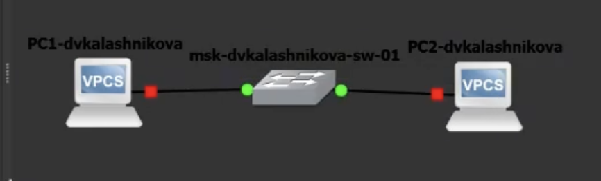{#fig-001 width=60%}

## Настройка PC1

Задан адрес 192.168.1.11/24, шлюз 192.168.1.1.

{#fig-002 width=60%}

## Настройка PC2

Задан адрес 192.168.1.12/24 с тем же шлюзом.

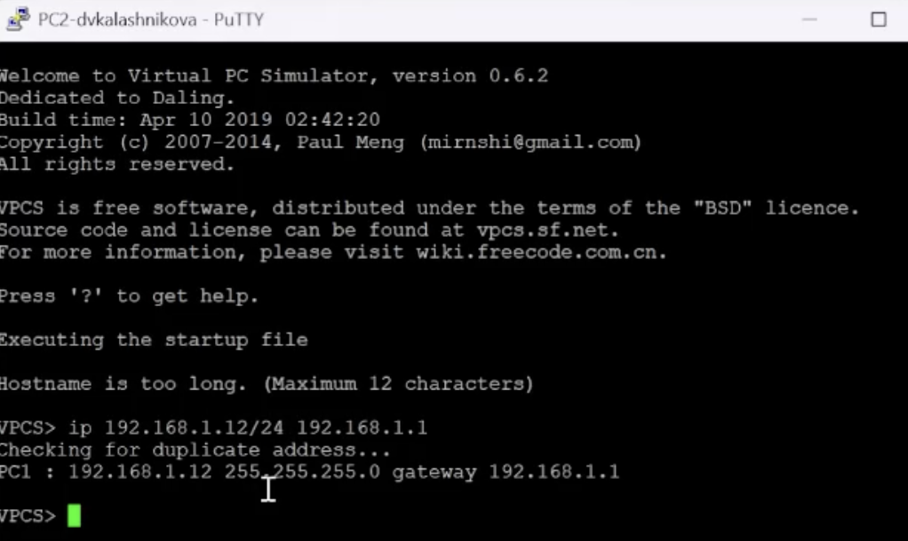{#fig-003 width=60%}

## Проверка связи ping

Пять откликов с TTL 64 — коммутация работает.

{#fig-004 width=60%}

## Захват на линии PC1 — коммутатор

Запущен перехват пакетов на выбранном участке.

{#fig-005 width=60%}

## Широковещательные ARP-запросы

Кадры идут на ff:ff:ff:ff:ff:ff — MAC получателя пока неизвестен.

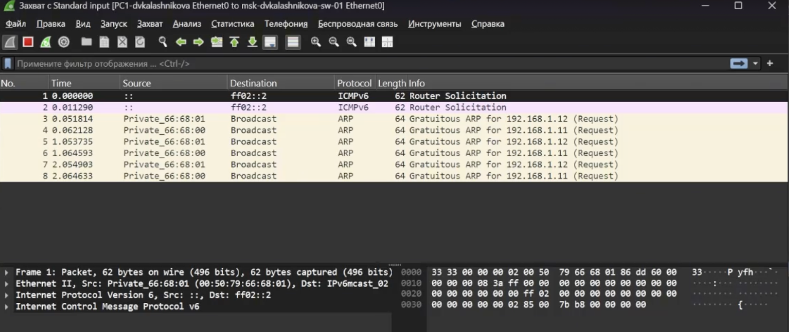{#fig-006 width=60%}

## Разбор ICMP Echo Request

Видна вложенность Ethernet II, IPv4 и ICMP.

{#fig-007 width=60%}

## Пара ARP Request/Reply

Узел узнаёт MAC владельца IPv4 и получает ответ.

{#fig-008 width=60%}

## Последовательность ICMP Echo

Запросы и ответы чередуются — ping без потерь.

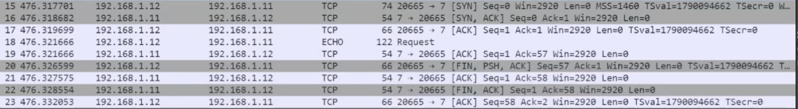{#fig-009 width=60%}

## Замена второго VPCS на FRR

Теперь проверяется и доступ PC1 к шлюзу.

{#fig-010 width=60%}

## Повторная настройка PC1

Адрес 192.168.1.10/24, шлюз 192.168.1.1.

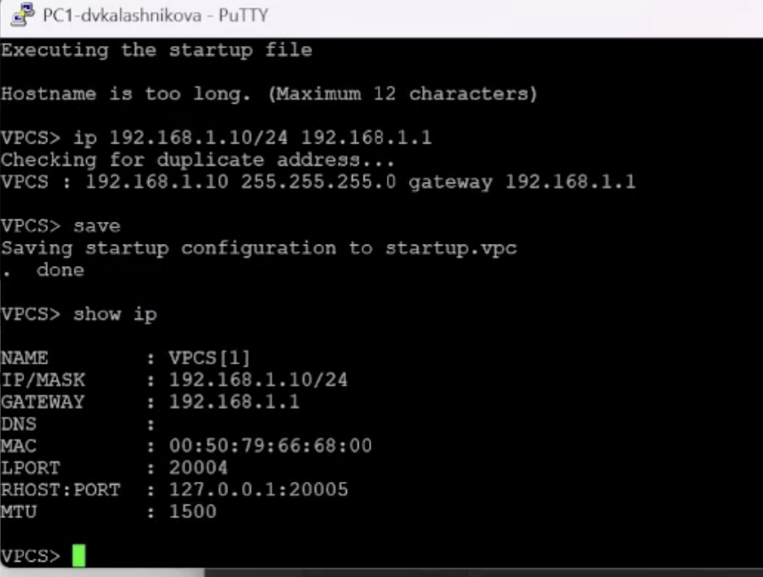{#fig-011 width=60%}

## Конфигурация FRR

Имя msk-dvkalashnikova-gw-01, eth0 — 192.168.1.1/24.

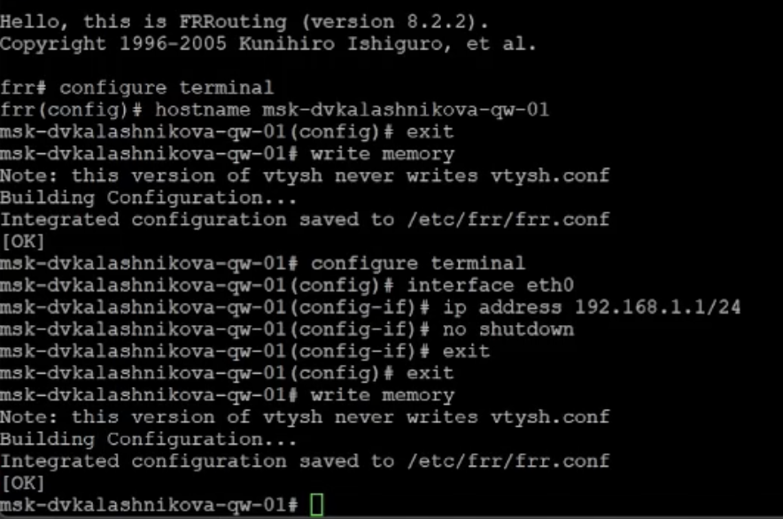{#fig-012 width=60%}

## Состояние eth0

Интерфейс up с адресом 192.168.1.1/24.

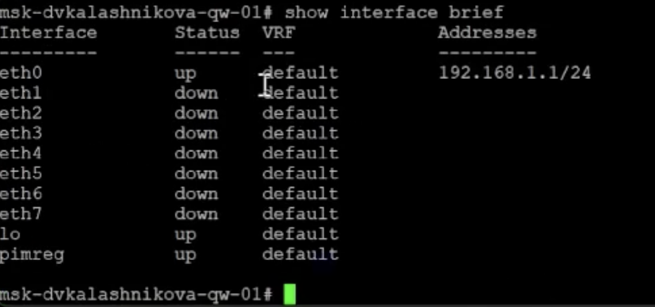{#fig-013 width=60%}

## Ping шлюза с PC1

Все запросы получили ответы — линия до FRR исправна.

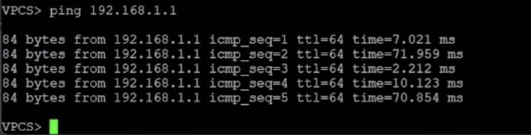{#fig-014 width=60%}

## ICMP-трафик на линии к FRR

Запросы от 192.168.1.10 и ответы от 192.168.1.1.

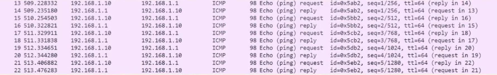{#fig-015 width=60%}

## Схема с FRR в работе

Зелёные точки — интерфейсы подняты.

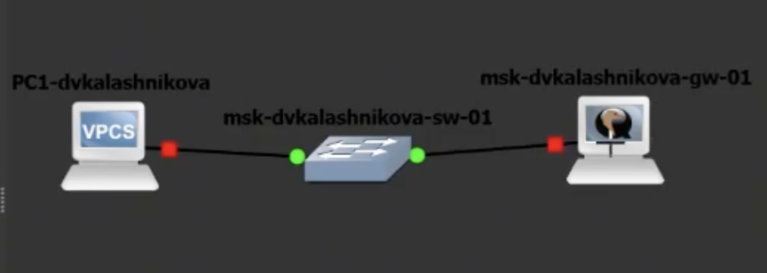{#fig-016 width=60%}

## Контроль show ip на PC1

Адрес 192.168.1.10/24 и шлюз 192.168.1.1 перед заменой.

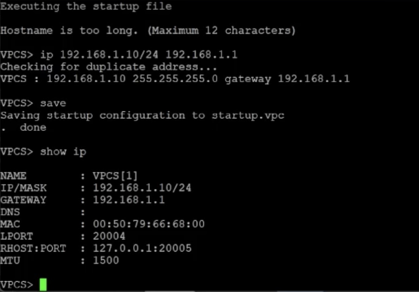{#fig-017 width=60%}

## Настройка VyOS

Удалён DHCP, задан статический 192.168.1.1/24 на eth0.

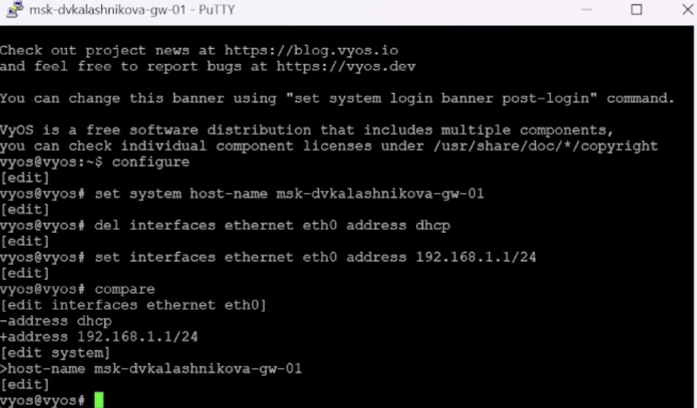{#fig-018 width=60%}

## Проверка VyOS после commit

eth0 в состоянии up с адресом 192.168.1.1/24.

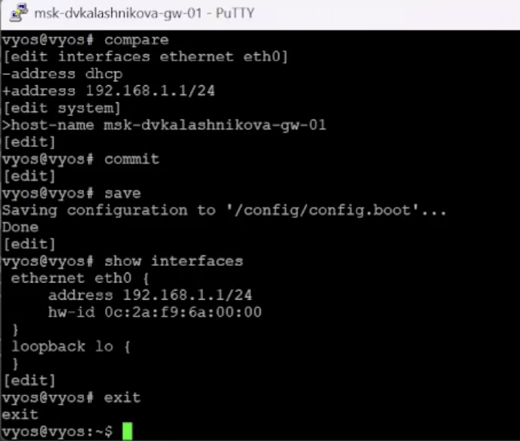{#fig-019 width=60%}

## Ping шлюза через VyOS

Результат совпадает с FRR — логика IPv4 не меняется.

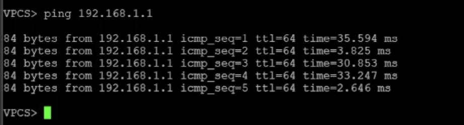{#fig-020 width=60%}

## ICMP-обмен PC1 ↔ VyOS

Wireshark показывает запросы и ответы между 192.168.1.10 и 192.168.1.1.

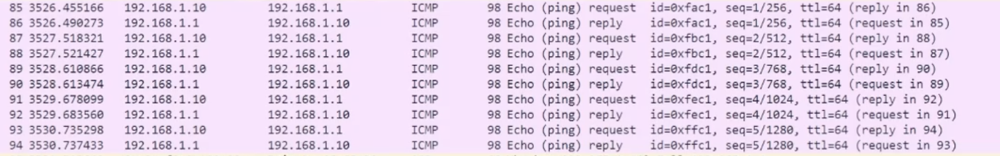{#fig-021 width=60%}

## Выводы

Освоено построение простых схем на коммутаторе и маршрутизаторе. Изучено поведение Ethernet, ARP и ICMP в Wireshark. Стенд работает корректно.
