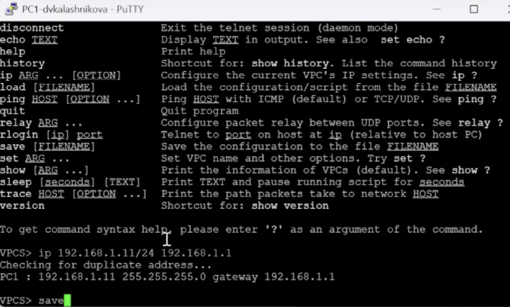
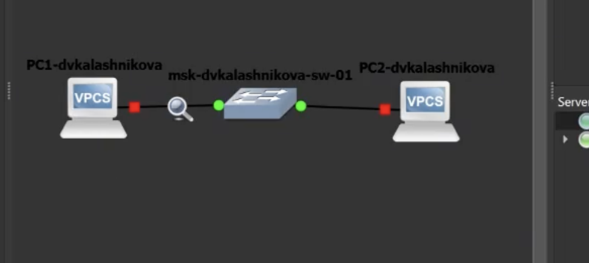
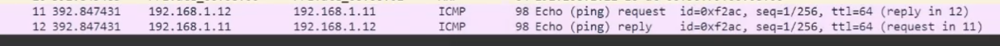
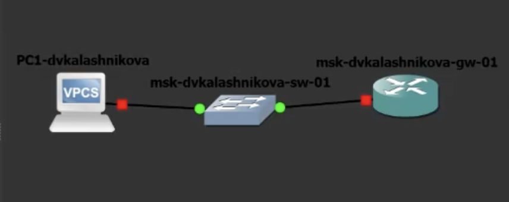

---
## Front matter
title: "Отчет о лабораторной работе"
subtitle: "Лабораторная работа №2"
author: "Калашникова Дарья"

## Generic otions
lang: ru-RU
toc-title: "Содержание"

## Bibliography
bibliography: bib/cite.bib
csl: pandoc/csl/gost-r-7-0-5-2008-numeric.csl

## Pdf output format
toc: true # Table of contents
toc-depth: 2
lof: true # List of figures
lot: true # List of tables
fontsize: 12pt
linestretch: 1.5
papersize: a4
documentclass: scrreprt
## I18n polyglossia
polyglossia-lang:
  name: russian
  options:
	- spelling=modern
	- babelshorthands=true
polyglossia-otherlangs:
  name: english
## I18n babel
babel-lang: russian
babel-otherlangs: english
## Fonts
mainfont: IBM Plex Serif
romanfont: IBM Plex Serif
sansfont: IBM Plex Sans
monofont: IBM Plex Mono
mathfont: STIX Two Math
mainfontoptions: Ligatures=Common,Ligatures=TeX,Scale=0.94
romanfontoptions: Ligatures=Common,Ligatures=TeX,Scale=0.94
sansfontoptions: Ligatures=Common,Ligatures=TeX,Scale=MatchLowercase,Scale=0.94
monofontoptions: Scale=MatchLowercase,Scale=0.94,FakeStretch=0.9
mathfontoptions:
## Biblatex
biblatex: true
biblio-style: "gost-numeric"
biblatexoptions:
  - parentracker=true
  - backend=biber
  - hyperref=auto
  - language=auto
  - autolang=other*
  - citestyle=gost-numeric
## Pandoc-crossref LaTeX customization
figureTitle: "Рис."
tableTitle: "Таблица"
listingTitle: "Листинг"
lofTitle: "Список иллюстраций"
lotTitle: "Список таблиц"
lolTitle: "Листинги"
## Misc options
indent: true
header-includes:
  - \usepackage{indentfirst}
  - \usepackage{float}
  - \floatplacement{figure}{H}
---

# Цель работы

Овладеть приёмами построения простейших сетей на коммутаторе и маршрутизаторе, а также разобрать поведение Ethernet, ARP и ICMP с помощью Wireshark.

# Задание

1. Собрать в GNS3 простейший локальный сегмент из двух узлов VPCS и одного Ethernet-коммутатора.
2. Настроить IP-адреса на PC1 и PC2 и проверить связь командой ping.
3. Включить захват пакетов на линии PC1 — коммутатор.
4. Разобрать в Wireshark широковещательные ARP-запросы, ICMP Echo Request/Reply и пару ARP Request/Reply.
5. Заменить второй VPCS программным маршрутизатором FRR и настроить интерфейс eth0.
6. Проверить доступность шлюза с PC1 и проанализировать ICMP-трафик на линии к FRR.
7. Заменить FRR на маршрутизатор VyOS, выполнить аналогичную настройку и проверку.
8. Сравнить поведение FRR и VyOS с точки зрения конечного узла.

# Выполнение лабораторной работы

В GNS3 собрана простейшая локальная сеть: пара узлов VPCS соединена через один Ethernet-коммутатор. Подобная конфигурация даёт возможность отследить обмен кадрами в пределах одного широковещательного домена, не задействуя маршрутизатор (рис. [-@fig:001]).

{#fig:001 width=70%}

На PC1 с помощью команды ip прописаны адрес 192.168.1.11/24 и шлюз 192.168.1.1, после чего show ip отобразил сохранённые значения. Префикс /24 относит оба узла к сети 192.168.1.0 (рис. [-@fig:002]).

{#fig:002 width=70%}

В консоли PC2 прописан адрес 192.168.1.12/24 с тем же шлюзом. Контрольный вывод демонстрирует иной MAC-адрес этого VPCS — это помогает отличать кадры двух машин в Wireshark (рис. [-@fig:003]).

{#fig:003 width=70%}

С PC1 отправлены ICMP Echo-запросы по адресу 192.168.1.12. Пришло пять откликов с TTL 64 и небольшой задержкой — значит, адресация и коммутация внутри сегмента работают корректно (рис. [-@fig:004]).

{#fig:004 width=70%}

Запущен перехват пакетов на участке между PC1 и коммутатором. Схема продолжает работать, а выбранная точка наблюдения даёт возможность увидеть как служебные ARP-кадры, так и последующий ICMP-трафик узла (рис. [-@fig:005]).

{#fig:005 width=70%}

В окне Wireshark отображаются широковещательные ARP-запросы о владельце 192.168.1.11. Кадры адресованы на ff:ff:ff:ff:ff:ff, так как MAC получателя ещё не известен до ответа (рис. [-@fig:006]).

{#fig:006 width=70%}

Выделен конкретный ICMP Echo Request. В верхней таблице видно соответствие исходного и конечного IPv4-адресов, а в деталях пакета — вложенность Ethernet II, IPv4 и ICMP (рис. [-@fig:007]).

{#fig:007 width=70%}

Захват демонстрирует пару ARP Request/Reply: узел сначала запрашивает аппаратный адрес владельца IPv4, а затем получает одноадресный ответ. После этого запись может быть помещена в ARP-кэш (рис. [-@fig:008]).

{#fig:008 width=70%}

В Wireshark поочерёдно показаны ICMP Echo Request и Echo Reply между 192.168.1.11 и 192.168.1.12. Чередование запросов и ответов соответствует успешному ping без потерь (рис. [-@fig:009]).

{#fig:009 width=70%}

Топология перестроена: второй VPCS заменён программным маршрутизатором FRR. Теперь проверяется не только коммутация, но и доступ PC1 к адресу интерфейса шлюза (рис. [-@fig:010]).

{#fig:010 width=70%}

PC1 перенастроен на адрес 192.168.1.10/24, а 192.168.1.1 указан как default gateway. Команда show ip подтверждает, какие параметры VPCS будет использовать при отправке пакетов за пределы подсети (рис. [-@fig:011]).

{#fig:011 width=70%}

В running-config FRR задано имя msk-dvkalashnikova-gw-01, а интерфейсу eth0 назначен 192.168.1.1/24. На снимке показана сохранённая конфигурация, а не только ввод отдельных команд (рис. [-@fig:012]).

{#fig:012 width=70%}

Команда show interface brief вывела eth0 в состоянии up с адресом 192.168.1.1/24. Остальные интерфейсы не задействованы, поэтому рабочий сегмент однозначно связан с eth0 (рис. [-@fig:013]).

{#fig:013 width=70%}

С PC1 выполнен ping адреса шлюза 192.168.1.1. Все запросы получили ответы, что подтверждает исправность линии PC1—коммутатор—FRR и совпадение сетевых масок (рис. [-@fig:014]).

{#fig:014 width=70%}

В захвате на линии к FRR видны ICMP-запросы от 192.168.1.10 и ответы от 192.168.1.1. Пакеты подтверждают тот же результат на сетевом уровне, который ранее наблюдался в консоли ping (рис. [-@fig:015]).

{#fig:015 width=70%}

Схема с PC1, Ethernet-коммутатором и FRR показана в рабочем состоянии. Зелёные точки на соединениях соответствуют поднятым интерфейсам после завершения адресной настройки (рис. [-@fig:016]).

{#fig:016 width=70%}

Повторный show ip на PC1 фиксирует адрес 192.168.1.10/24 и шлюз 192.168.1.1 перед заменой маршрутизатора. Эти исходные параметры оставлены неизменными для корректного сравнения FRR и VyOS (рис. [-@fig:017]).

{#fig:017 width=70%}

В конфигурационном режиме VyOS удалён адрес, получаемый по DHCP, задано имя узла и установлен статический 192.168.1.1/24 на eth0. Команда compare показывает ожидаемые изменения до их применения (рис. [-@fig:018]).

{#fig:018 width=70%}

После commit и save команда show interfaces выводит eth0 в состоянии up с адресом 192.168.1.1/24. Конфигурация сохранена в config.boot и будет восстановлена после перезагрузки (рис. [-@fig:019]).

{#fig:019 width=70%}

PC1 успешно отвечает на ping к 192.168.1.1 уже при работе VyOS. Совпадение результата с FRR показывает, что для конечного узла реализация маршрутизатора не меняет логику IPv4-обмена (рис. [-@fig:020]).

{#fig:020 width=70%}

Wireshark зарегистрировал ICMP Echo между PC1 и интерфейсом VyOS. В колонках Source и Destination видны адреса 192.168.1.10 и 192.168.1.1, а ответы следуют за каждым запросом (рис. [-@fig:021]).

{#fig:021 width=70%}

# Выводы

Поставленная цель выполнена: освоено построение простых схем на коммутаторе и маршрутизаторе, а также изучено поведение Ethernet, ARP и ICMP в Wireshark. Полученные результаты подтверждают работоспособность собранного стенда и корректность выполненной настройки.
