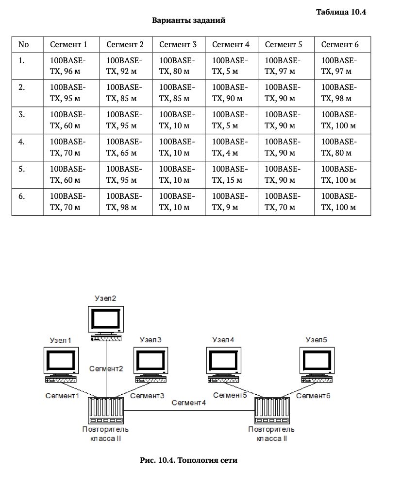
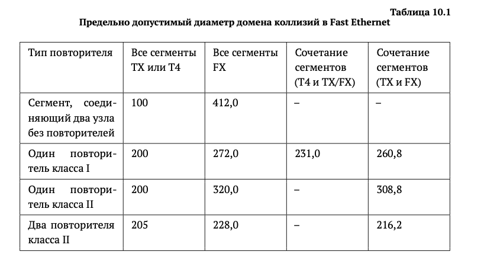
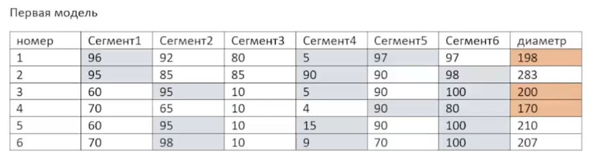
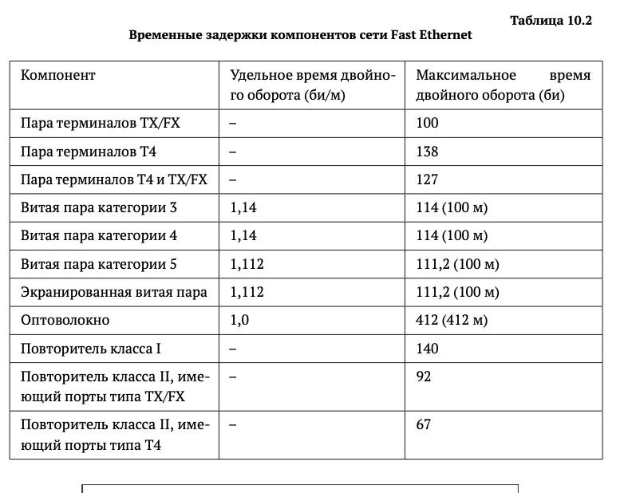

# Информация

## Докладчик

:::::::::::::: {.columns align=center}
::: {.column width="70%"}

  * Калашникова Дарья Викторовна
  * Студент
  * Российский университет дружбы народов
  * [1132243108@pfur.ru](mailto:1132243108@pfur.ru)

:::
::: {.column width="30%"}

:::
::::::::::::::

## Цель работы

Освоить принципы Ethernet и Fast Ethernet и применить методики оценки работоспособности сети Fast Ethernet.

## Задание

Проверить работоспособность сети по двум моделям.

{#fig-001 width=60%}

## Первая модель: диаметр домена коллизий

Диаметр домена коллизий — наибольшее расстояние между двумя узлами. При двух повторителях класса 2 и витой паре допустимо не больше 205 метров.

{#fig-002 width=60%}

## Таблица диаметров

Составим таблицу: 7 строк (номер сегмента + варианты), 8 столбцов (вариант, длины сегментов, диаметр). Сегменты, входящие в диаметр, выделим.

{#fig-003 width=60%}

## Результат первой модели

Варианты 1, 3 и 4 — диаметр меньше 205 м (работоспособны). Варианты 2, 5 и 6 — диаметр больше 205 м (неработоспособны).

## Вторая модель: битовые интервалы

Считаем битовые интервалы для наихудшего пути, прибавляем 4 и сравниваем с 512. Посмотрим вклад каждого устройства.

{#fig-004 width=60%}

## Как считаем

Ищем участок между двумя узлами с наибольшим временем двойного оборота. Наихудшие пути уже найдены, но для варианта 4 это не гарантировано — путь идёт через второй повторитель с большой задержкой.

## Вариант 1

100 + 96 × 1,112 + 92 + 5 × 1,112 + 92 + 97 × 1,112 = 504,176.  
Прибавляем 4 => **508,176**.

## Вариант 2

100 + 95 × 1,112 + 92 + 90 × 1,112 + 92 + 98 × 1,112 = 598,584.  
Прибавляем 4 => **602,584**.

## Вариант 3

100 + 95 × 1,112 + 92 + 5 × 1,112 + 92 + 100 × 1,112 = 506,4.  
Прибавляем 4 => **510,4**.

## Вариант 4

100 + 70 × 1,112 + 92 + 4 × 1,112 + 92 + 90 × 1,112 = 466,368.  
Прибавляем 4 => **470,368**.

## Вариант 5

100 + 95 × 1,112 + 92 + 15 × 1,112 + 92 + 100 × 1,112 = 517,52.  
Прибавляем 4 => **521,52**.

## Вариант 6

100 + 98 × 1,112 + 92 + 9 × 1,112 + 92 + 100 × 1,112 = 514,184.  
Прибавляем 4 => **518,184**.

## Результат второй модели

Варианты 1, 3 и 4 — сумма меньше 512 (работоспособны). Варианты 2, 5 и 6 — сумма больше 512 (неработоспособны).

## Выводы

Освоены принципы Ethernet и Fast Ethernet и методики оценки работоспособности сети. Варианты 1, 3 и 4 работоспособны по обеим моделям, варианты 2, 5 и 6 — нет.
