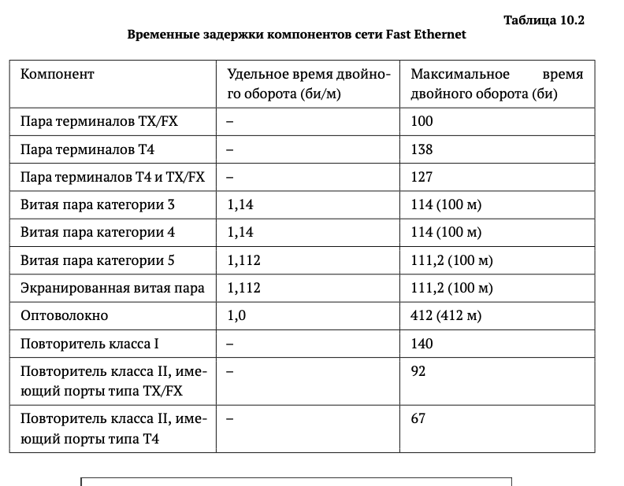

# Цель работы

Освоить принципы работы технологий Ethernet и Fast Ethernet, а также практически применить методики оценки работоспособности сети, построенной на базе Fast Ethernet.

# Задание

Проверить работоспособность приведённой ниже сети по двум моделям.

# Первая модель

Диаметр домена коллизий — это наибольшее расстояние между любыми двумя узлами этого домена. В нашей топологии используются два повторителя класса 2, а все узлы подключены только витой парой, поэтому согласно таблице ниже предельно допустимый диаметр составляет 205 метров (@fig-002).

{#fig-002 width=70%}

Составим таблицу: семь строк (первая — номер сегмента, остальные — варианты задания) и восемь столбцов (первый — номер варианта, последний — диаметр, промежуточные — длины сегментов). Сегменты, попадающие в диаметр, выделим (@fig-003).

{#fig-003 width=70%}

Видно, что у вариантов 1, 3 и 4 диаметр не превышает 205 метров, значит, они работоспособны. У вариантов 2, 5 и 6 диаметр больше 205 метров, значит, они неработоспособны.

# Вторая модель

Во второй модели необходимо посчитать количество битовых интервалов для наихудшего по распространению сигнала пути, прибавить к полученному значению 4 битовых интервала и сравнить результат с числом 512. Посмотрим, сколько битовых интервалов вносит каждое устройство нашей топологии согласно таблице ниже (@fig-004).

{#fig-004 width=70%}

Как видно, нужно учитывать, через какие устройства проходит путь и какова их задержка, выраженная во времени двойного оборота. Необходимо найти участок между двумя узлами с наибольшим временем двойного оборота. Очевидно, что наихудшие пути для всех вариантов уже были найдены при расчёте первой модели, однако для варианта 4 это не гарантировано: там самый длинный путь проходил не через два повторителя, а второй повторитель вносит заметную задержку двойного оборота. Приступаем к подсчёту.

## Первый вариант

Наихудший путь даёт следующее количество временных интервалов:   
100 (узел) + 96 * 1,112 (первый сегмент) + 92 (повторитель класса 2) + 5 * 1,112 (четвёртый сегмент) + 92 (повторитель класса 2) + 97 * 1,112 (пятый сегмент) = 504,176.  
Прибавляем 4 => 508,176.

## Второй вариант

Наихудший путь даёт следующее количество временных интервалов:   
100 (узел) + 95 * 1,112 (первый сегмент) + 92 (повторитель класса 2) + 90 * 1,112 (четвёртый сегмент) + 92 (повторитель класса 2) + 98 * 1,112 (шестой сегмент) = 598,584.  
Прибавляем 4 => 602,584.

## Третий вариант

Наихудший путь даёт следующее количество временных интервалов:   
100 (узел) + 95 * 1,112 (второй сегмент) + 92 (повторитель класса 2) + 5 * 1,112 (четвёртый сегмент) + 92 (повторитель класса 2) + 100 * 1,112 (шестой сегмент) = 506,4.  
Прибавляем 4 => 510,4.

## Четвёртый вариант

Наихудший путь даёт следующее количество временных интервалов (отметим, что путь отличается от найденного в первой модели: он всего на 6 метров короче, зато проходит через второй повторитель, который вносит задержку существенно больше, чем 6 метров витой пары):   
100 (узел) + 70 * 1,112 (первый сегмент) + 92 (повторитель класса 2) + 4 * 1,112 (четвёртый сегмент) + 92 (повторитель класса 2) + 90 * 1,112 (пятый сегмент) = 466,368.  
Прибавляем 4 => 470,368.

## Пятый вариант

Наихудший путь даёт следующее количество временных интервалов:   
100 (узел) + 95 * 1,112 (второй сегмент) + 92 (повторитель класса 2) + 15 * 1,112 (четвёртый сегмент) + 92 (повторитель класса 2) + 100 * 1,112 (шестой сегмент) = 517,52.  
Прибавляем 4 => 521,52.

## Шестой вариант

Наихудший путь даёт следующее количество временных интервалов:   
100 (узел) + 98 * 1,112 (второй сегмент) + 92 (повторитель класса 2) + 9 * 1,112 (четвёртый сегмент) + 92 (повторитель класса 2) + 100 * 1,112 (шестой сегмент) = 514,184.  
Прибавляем 4 => 518,184.

## Результаты по второй модели

Получается, что варианты 1, 3 и 4 работоспособны, поскольку время двойного оборота по наихудшему пути с добавленными 4 интервалами меньше 512. Варианты 2, 5 и 6 неработоспособны.

# Выводы

В результате выполнения работы были получены навыки анализа работоспособности Ethernet-сетей и понимание принципов их работы.
