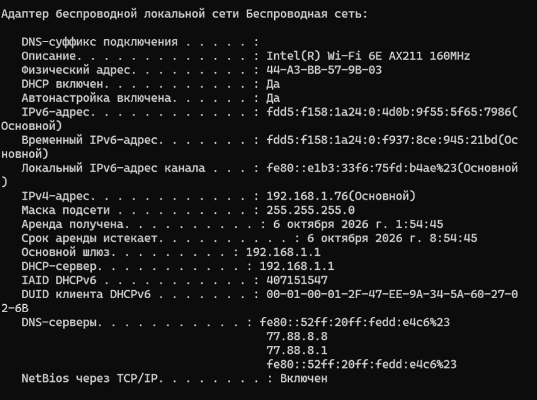
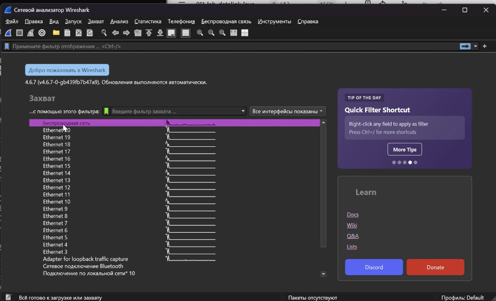
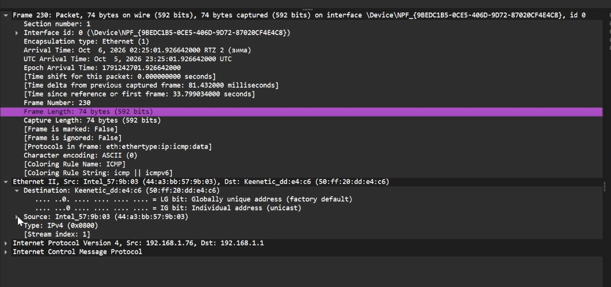
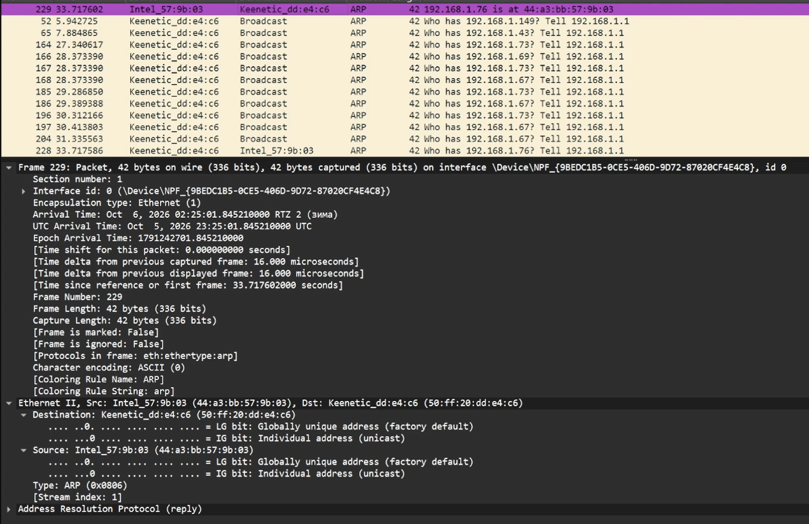
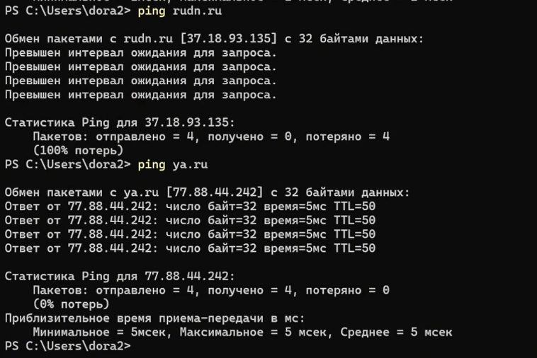
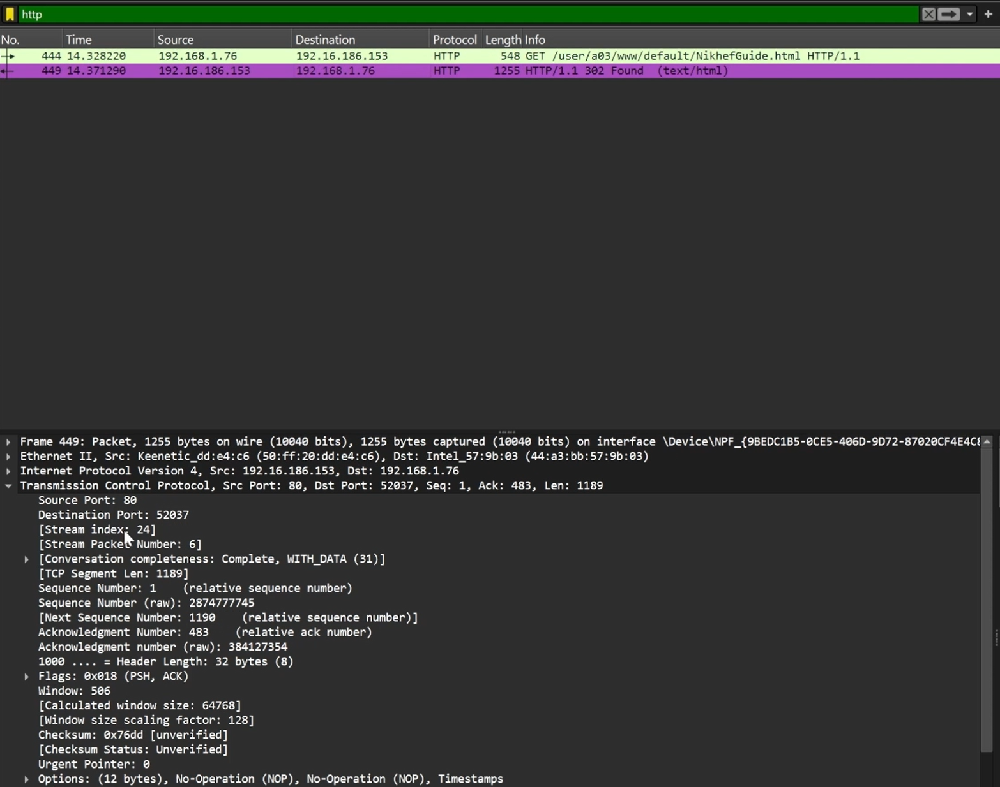
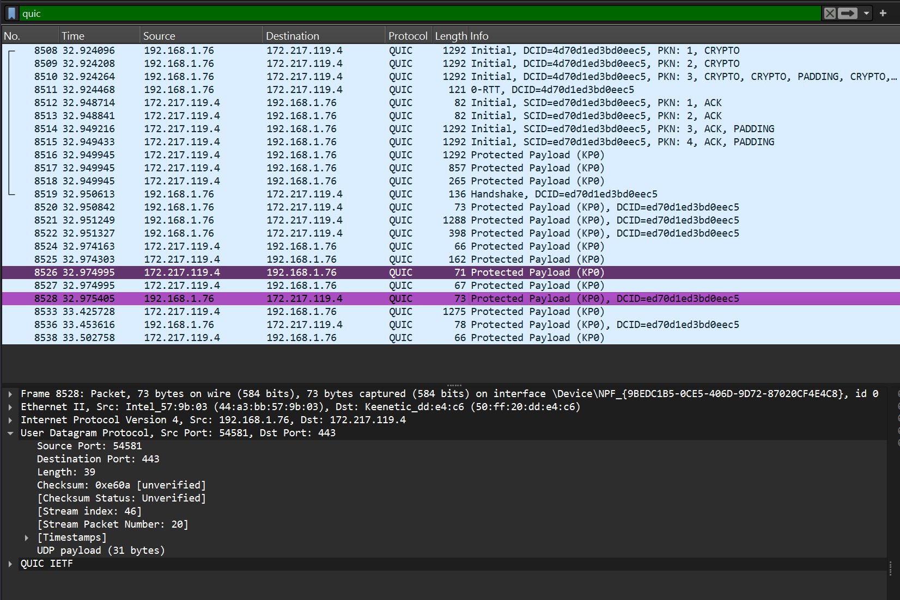
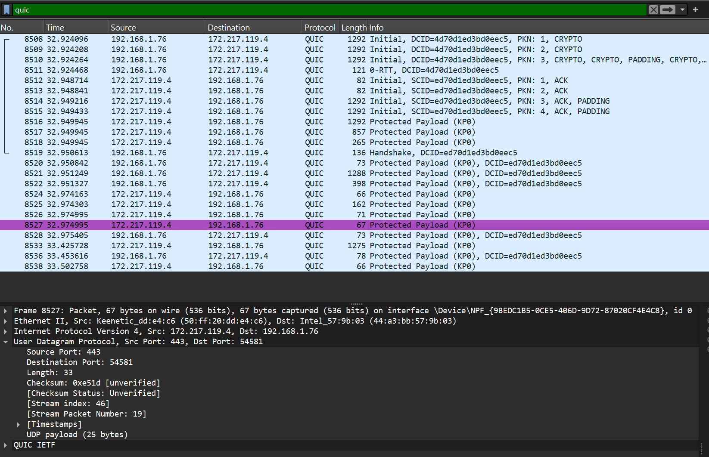
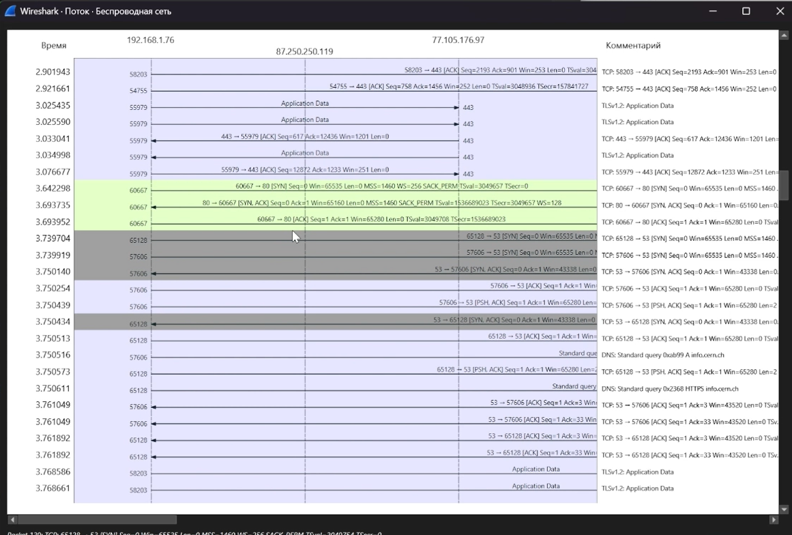

# Информация

## Докладчик

:::::::::::::: {.columns align=center}
::: {.column width="70%"}

  * Калашникова Дарья Викторовна
  * Студент
  * Российский университет дружбы народов
  * [1132243108@pfur.ru](mailto:1132243108@pfur.ru)

:::
::: {.column width="30%"}

:::
::::::::::::::

## Цель работы

Освоить работу с анализатором трафика Wireshark: разобрать кадры Ethernet и изучить PDU транспортного и прикладного уровней стека TCP/IP на реальном трафике.

## Задание

1. Получить сведения о сетевых интерфейсах через ipconfig.
2. Запустить захват трафика в Wireshark на активном интерфейсе.
3. Проверить связь с шлюзом и разобрать ICMP.
4. Разобрать ARP-запросы и ARP-ответы.
5. Пингануть внешние узлы (rudn.ru, ya.ru) и проанализировать ICMP.
6. Открыть сайт по HTTP и разобрать TCP-сегменты.
7. Изучить DNS и QUIC — работу прикладных протоколов поверх UDP.
8. Разобрать тройное рукопожатие TCP (SYN, SYN+ACK, ACK).

## ipconfig

Активное подключение — беспроводная сеть. Видим IPv4/IPv6, маску и шлюз.

{#fig:001 width=60%}

## ipconfig /all

MAC 44-a3-bb-57-9b-03, IPv4 192.168.1.76, маска 255.255.255.0, шлюз 192.168.1.1.

{#fig:002 width=40%}

## Выбор соединения

В Wireshark выбираем активный беспроводной интерфейс для захвата.

{#fig:003 width=60%}

## Интерфейс Wireshark

Общий вид окна Wireshark: список пакетов, детали, hex-дамп.

{#fig:004 width=60%}

## ping шлюза

4 из 4 пакетов, TTL=64, время около 1 мс, потерь нет.

{#fig:005 width=60%}

## ICMP-пакеты

8 строк: 4 отправки и 4 ответа между 192.168.1.76 и 192.168.1.1.

{#fig:006 width=60%}

## Исходящий ICMP

Кадр 74 байта, Ethernet II, Intel → Keentic, внутри IPv4 и ICMP.

{#fig:007 width=60%}

## Входящий ICMP

MAC-адреса стоят в обратном порядке: 50:ff:20:dd:e4:c6 → 44:a3:bb:57:9b:03.

{#fig:008 width=60%}

## ARP-запрос

Who has 192.168.1.76? Tell 192.168.1.1 — шлюз ищет наш MAC.

{#fig:009 width=60%}

## ARP-ответ

192.168.1.76 is at 44:a3:bb:57:9b:03 — тип reply.

{#fig:010 width=60%}

## ping rudn.ru и ya.ru

rudn.ru — 100 % потерь, ya.ru (77.88.44.242) — 4 из 4.

{#fig:011 width=60%}

## ARP для ya.ru

Снова запрос Who has 192.168.1.76? и ответ 192.168.1.76 is at 44:a3:bb:57:9b:03.

{#fig:012 width=60%}

## Второй ARP

Отличается только направлением, тип reply.

{#fig:013 width=60%}

## ICMP к ya.ru

На сетевом уровне адрес 77.88.44.242, на Ethernet — по-прежнему шлюз.

{#fig:014 width=60%}

## Ответ от ya.ru

Источник 77.88.44.242, получатель 192.168.1.76.

{#fig:015 width=60%}

## HTTP-подключение

Открываем info.cern.ch по http поверх TCP.

{#fig:016 width=60%}

## Исходящий HTTP

GET /... HTTP/1.1, порт 52037 → 80, TCP с флагами PSH, ACK.

{#fig:017 width=40%}

## Входящий HTTP

Источник 192.16.186.153:80, ответ HTTP/1.1 302 Found, длина 1189.

{#fig:018 width=40%}

## Исходящий DNS

DNS поверх UDP, порт источника 53, сервер 77.88.8.1.

{#fig:019 width=60%}

## Входящий DNS

Порты 53 → 49664, отличаются длина и контрольная сумма.

{#fig:020 width=40%}

## Исходящий QUIC

QUIC поверх UDP: 54581 → 443.

{#fig:021 width=40%}

## Входящий QUIC

Порты в обратном порядке: 443 → 54581.

{#fig:022 width=40%}

## SYN

Клиент 192.168.1.76:57608 → 13.249.8.110:443, флаг SYN, seq=0.

{#fig:023 width=40%}

## SYN + ACK

Ответ сервера: SYN, ACK, seq=0, ack=1.

{#fig:024 width=40%}

## ACK

Клиент подтверждает: только ACK, seq=1, ack=1.

{#fig:025 width=40%}

## Хендшейк на графике потока

Хорошо видны SYN, SYN+ACK, ACK перед GET.

{#fig:026 width=40%}

## Выводы

Получены навыки анализа пакетов в Wireshark: разобраны кадры Ethernet, PDU транспортного и прикладного уровней стека TCP/IP.

## Список литературы

1. Wireshark Foundation. Wireshark User's Guide [Электронный ресурс]. — URL: https://www.wireshark.org/docs/wsug_html_chunked/ (дата обращения: 07.10.2026).

2. Wireshark Foundation. Wireshark Display Filter Reference [Электронный ресурс]. — URL: https://www.wireshark.org/docs/dfref/ (дата обращения: 07.10.2026).

3. IETF. RFC 826: An Ethernet Address Resolution Protocol [Электронный ресурс]. — URL: https://datatracker.ietf.org/doc/html/rfc826 (дата обращения: 07.10.2026).
