# Цель работы

Освоить работу с Wireshark: разобрать кадры Ethernet и проанализировать PDU транспортного и прикладного уровней стека TCP/IP.

# Выполнение

Сначала выполним ipconfig. В выводе увидим несколько подключений, среди них и активное — беспроводная сеть. Из него мы узнаём ipv6 и ipv4 адреса, маску подсети и адрес основного шлюза (рис. [-@fig:001]).

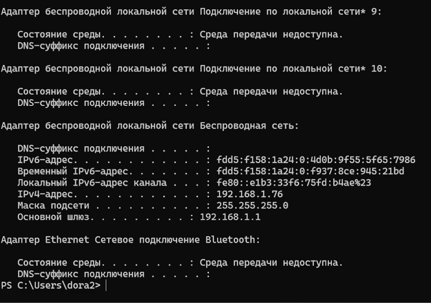{#fig:001 width=70%}

Если добавить к ipconfig ключ /all, данных станет больше — в частности, появится физический (mac) адрес. У нас он равен 44-a3-bb-57-9b-03. Из этих шести байт первые три — идентификатор производителя, оставшиеся три — самого интерфейса. Старший байт 44 говорит о том, что адрес индивидуальный и глобально администрируемый: два младших бита этого байта при переводе из hex в двоичную дают нули. Также в выводе видны ipv4-адрес 192.168.1.76, маска 255.255.255.0, шлюз 192.168.1.1, аренда получена 6 октября 2026 г. до 8:54:45 (рис. [-@fig:002]).

{#fig:002 width=70%}

Открываем wireshark и выбираем активное сетевое подключение. У нас это беспроводная сеть (рис. [-@fig:003]).

{#fig:003 width=70%}

Так выглядит сам интерфейс (рис. [-@fig:004]).

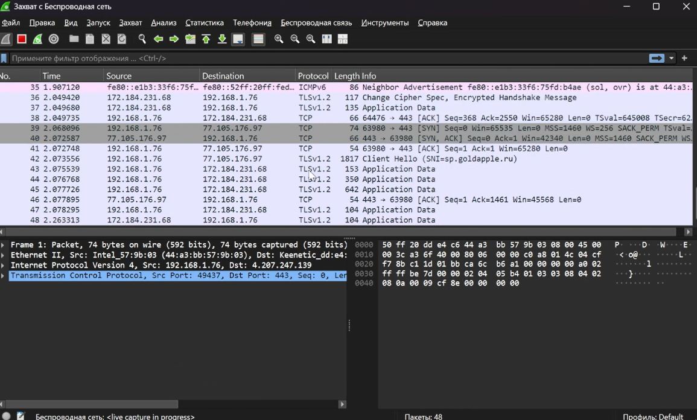{#fig:004 width=70%}

Попробуем отправить ping на шлюз 192.168.1.1. Все 4 пакета получили ответ с TTL=64 и временем 1 мс. Потерь нет (рис. [-@fig:005]).

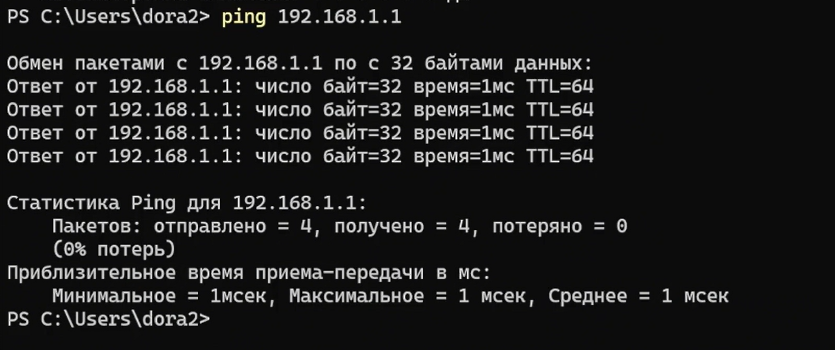{#fig:005 width=70%}

Возвращаемся в wireshark и смотрим на icmp-пакеты. Поскольку ушло 4 пакета, видим 8 строк — по одной на отправку и получение для каждого пакета. Отправитель — 192.168.1.76, получатель — 192.168.1.1 (рис. [-@fig:006]).

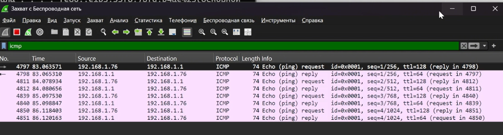{#fig:006 width=70%}

Разберём самый первый, исходящий пакет. Длина кадра — 74 байта, тип — ethernet 2; физический адрес отправителя (наш) — Intel_57:9b:03 (44:a3:bb:57:9b:03), получателя (шлюз) — Keentic_dd:e4:c6 (50:ff:20:dd:e4:c6). Оба адреса индивидуальные и глобально администрируемые. Внутри — IPv4 и ICMP (рис. [-@fig:007]).

{#fig:007 width=70%}

Теперь посмотрим на ответный фрейм. Он почти не отличается от исходящего — только адреса отправителя и получателя стоят наоборот: 50:ff:20:dd:e4:c6 → 44:a3:bb:57:9b:03 (рис. [-@fig:008]).

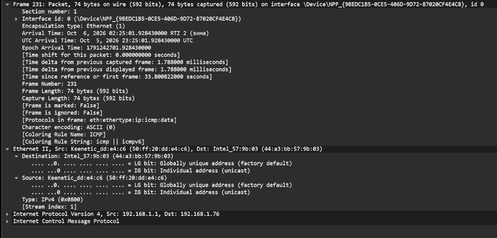{#fig:008 width=70%}

Переходим к arp-пакетам. Информации в них немного; задача этих пакетов — узнать физический адрес. Первый arp-пакет — запрос: `Who has 192.168.1.76? Tell 192.168.1.1`, то есть шлюз пытается определить адрес нашего устройства (рис. [-@fig:009]).

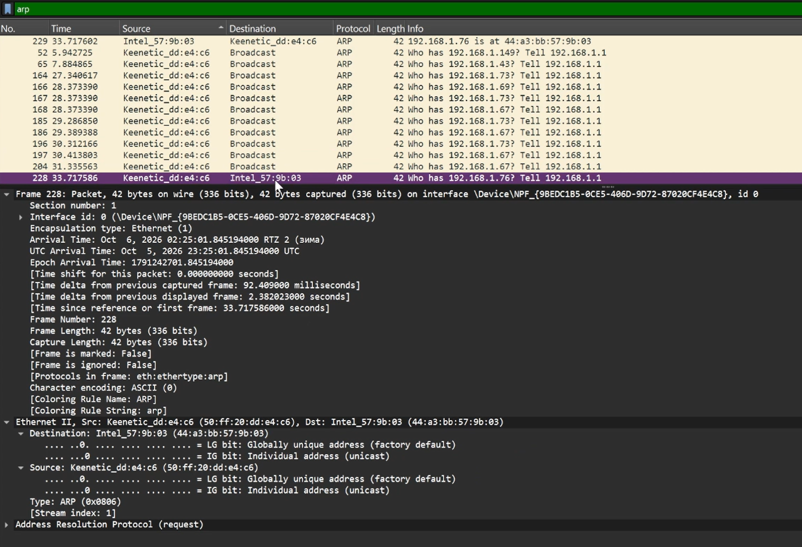{#fig:009 width=70%}

Второй arp-пакет — ответ: `192.168.1.76 is at 44:a3:bb:57:9b:03`. В обоих случаях в заголовке ethernet 2 лежит физический адрес обоих устройств, но в первом пакете тип — arp (request), во втором — arp (reply) (рис. [-@fig:010]).

{#fig:010 width=70%}

Теперь пингуем rudn.ru — он не отвечает: превышен интервал ожидания для запроса, 4 отправлено, 0 получено, 100 % потерь. Зато ya.ru (77.88.44.242) отвечает: 4 отправлено, 4 получено (рис. [-@fig:011]).

{#fig:011 width=70%}

Смотрим на arp-пакеты для ya.ru: снова запрос `Who has 192.168.1.76? Tell 192.168.1.1` и ответ `192.168.1.76 is at 44:a3:bb:57:9b:03` (рис. [-@fig:012]).

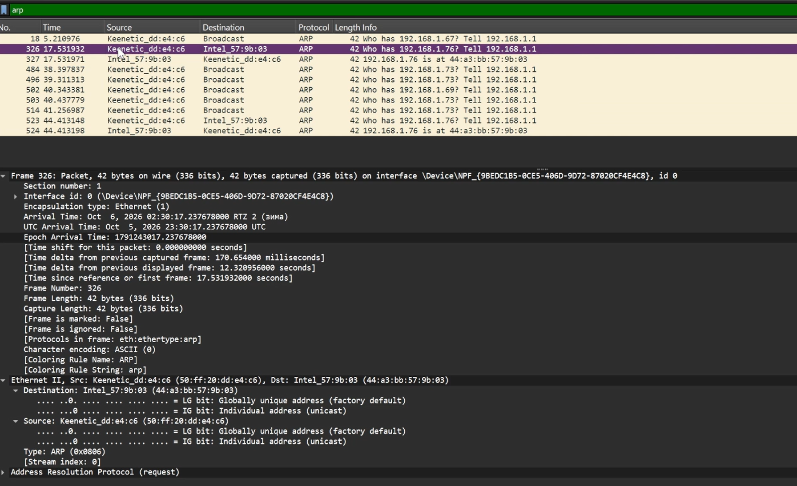{#fig:012 width=70%}

Второй arp-пакет, как обычно, отличается только направлением (рис. [-@fig:013]).

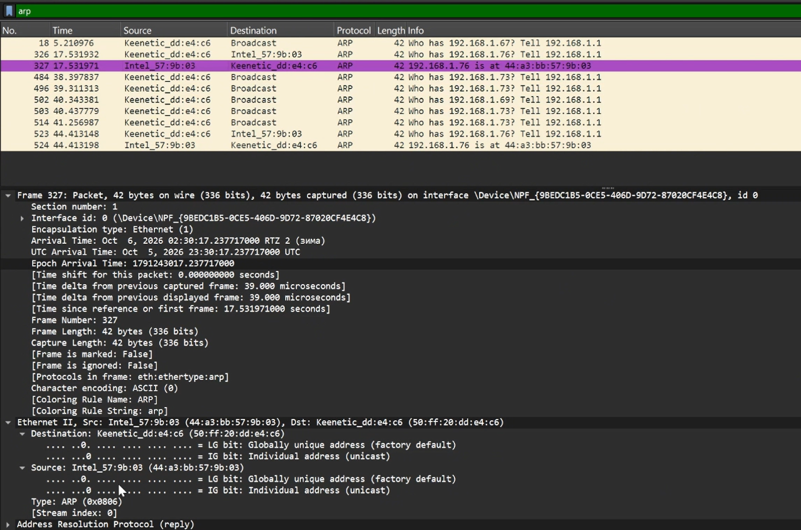{#fig:013 width=70%}

Теперь смотрим icmp-пакеты для ya.ru: их восемь. Обращаемся мы уже не к шлюзу, а напрямую к серверу Яндекса — ip-адрес 77.88.44.242. Однако на уровне ethernet 2 мы по-прежнему общаемся со шлюзом (рис. [-@fig:014]).

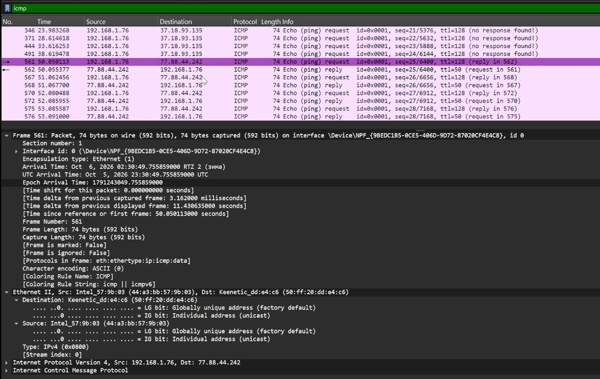{#fig:014 width=70%}

Входящий icmp — ответный. Отличается от исходного тем, что адреса поменяны местами: источник 77.88.44.242, получатель 192.168.1.76 (рис. [-@fig:015]).

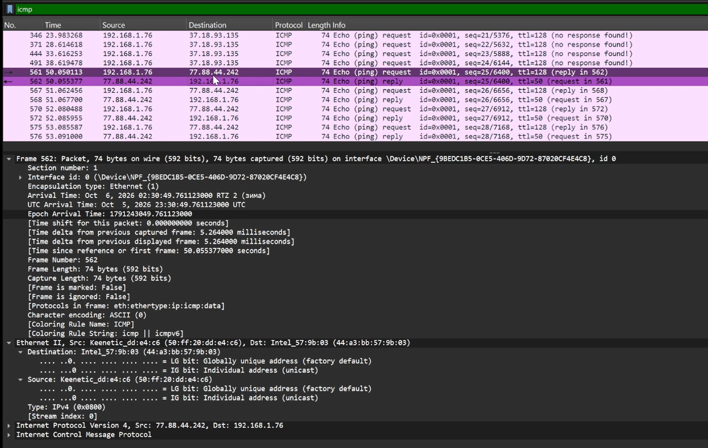{#fig:015 width=70%}

Откроем сайт по протоколу http — info.cern.ch (рис. [-@fig:016]).

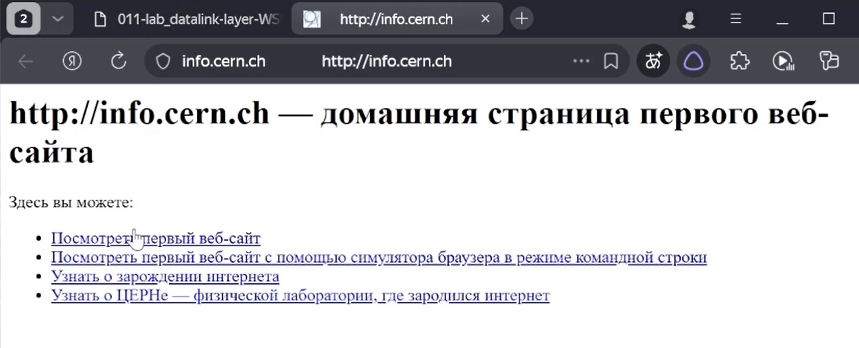{#fig:016 width=70%}

Смотрим http-пакеты: GET /user/a03/www/default/NikhefGuide.html HTTP/1.1 уходит на 192.16.186.153 с порта 52037 на 80. Работает http поверх tcp — видим порты, длину сегмента, флаги (PSH, ACK) и чексумму (рис. [-@fig:017]).

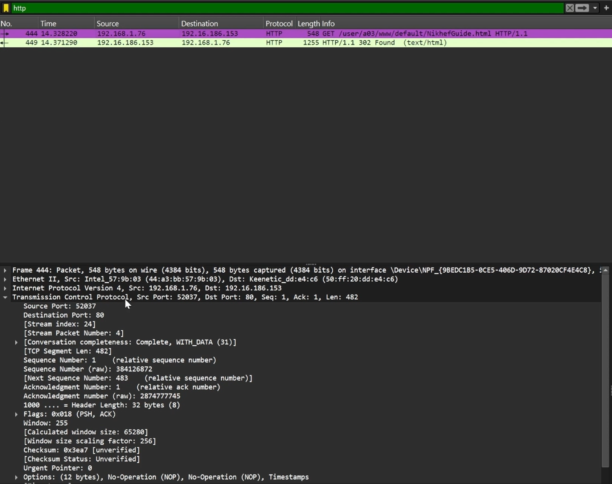{#fig:017 width=70%}

У входящего пакета источник — 192.16.186.153, порт 80, а получатель — 192.168.1.76, порт 52037. Длина сегмента 1189, ответ `HTTP/1.1 302 Found` (рис. [-@fig:018]).

{#fig:018 width=70%}

Теперь рассмотрим dns-пакеты. Они работают по udp, порт источника 53 — то есть пакеты приходят от DNS-сервера 77.88.8.1. Видны порты, длина и чексумма (рис. [-@fig:019]).

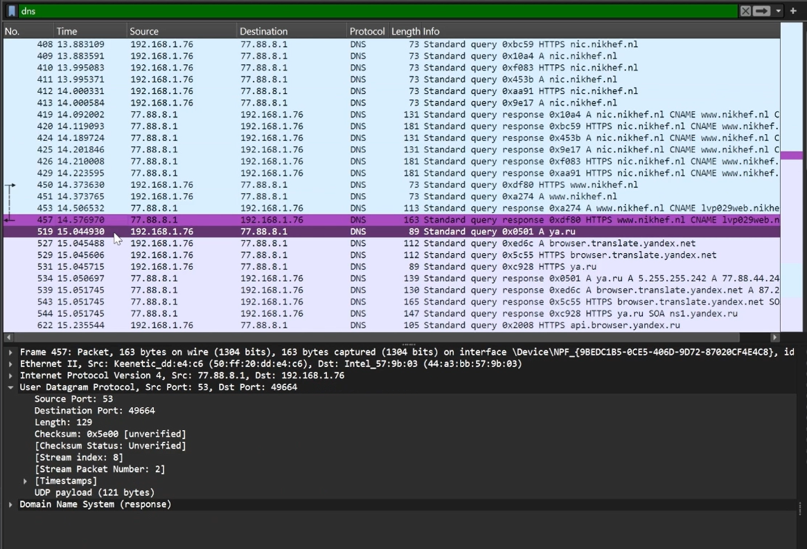{#fig:019 width=70%}

Входящий dns-пакет на уровне udp отличается портами: источник 53, получатель 49664. Также отличаются длина и чексумма (рис. [-@fig:020]).

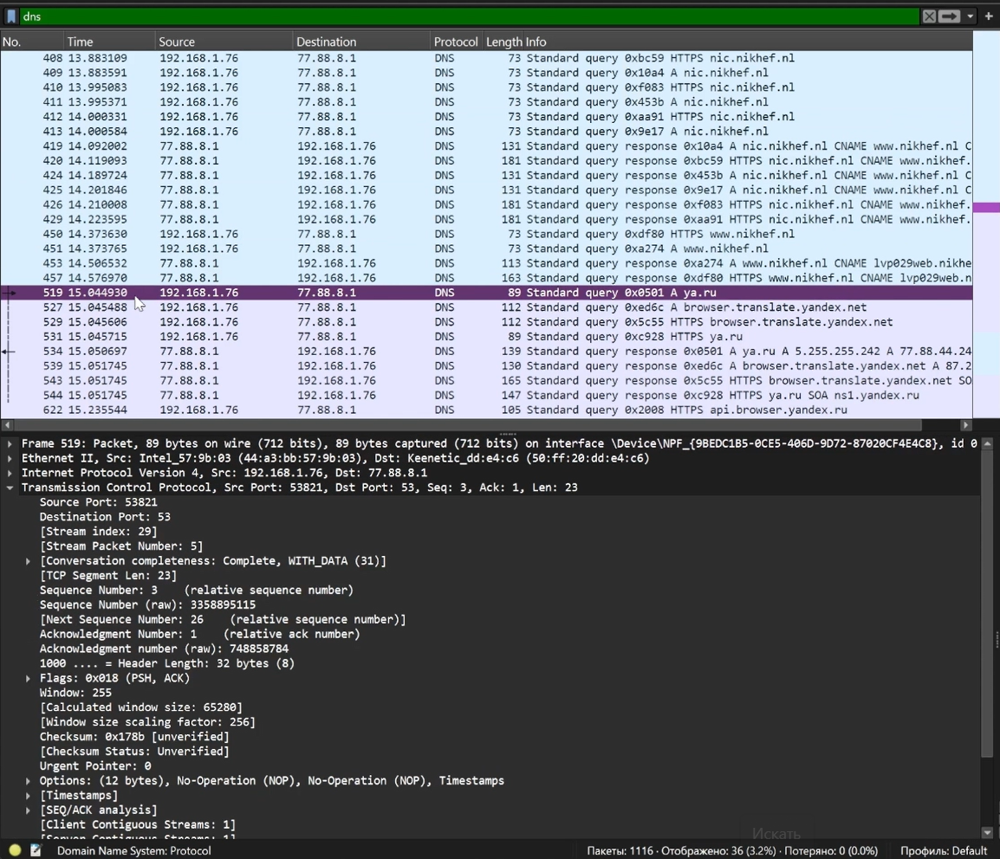{#fig:020 width=70%}

Теперь посмотрим на quic. Он работает поверх udp: порт источника 54581, получателя — 443. Внутри udp содержится примерно та же информация, что и в dns: порты, длина, чексумма (рис. [-@fig:021]).

{#fig:021 width=70%}

У входящего quic-пакета порты идут в обратном порядке: 443 → 54581. Также отличаются длина и чексумма (рис. [-@fig:022]).

{#fig:022 width=70%}

Теперь разберём процесс хендшейка. Для этого обновим http-страницу и посмотрим, что происходит перед http-запросом get. Сначала клиент (192.168.1.76, порт 57608) отправляет серверу (13.249.8.110, порт 443) syn-запрос. Во флагах tcp видим только SYN, sequence number — 0 (рис. [-@fig:023]).

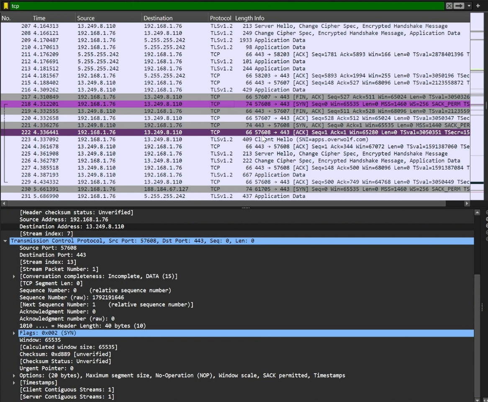{#fig:023 width=70%}

Сервер отвечает syn и ack: источник 13.249.8.110, порт 443, получатель 192.168.1.76, порт 57608. Во флагах видим SYN, ACK, sequence number 0, acknowledgment number 1 (рис. [-@fig:024]).

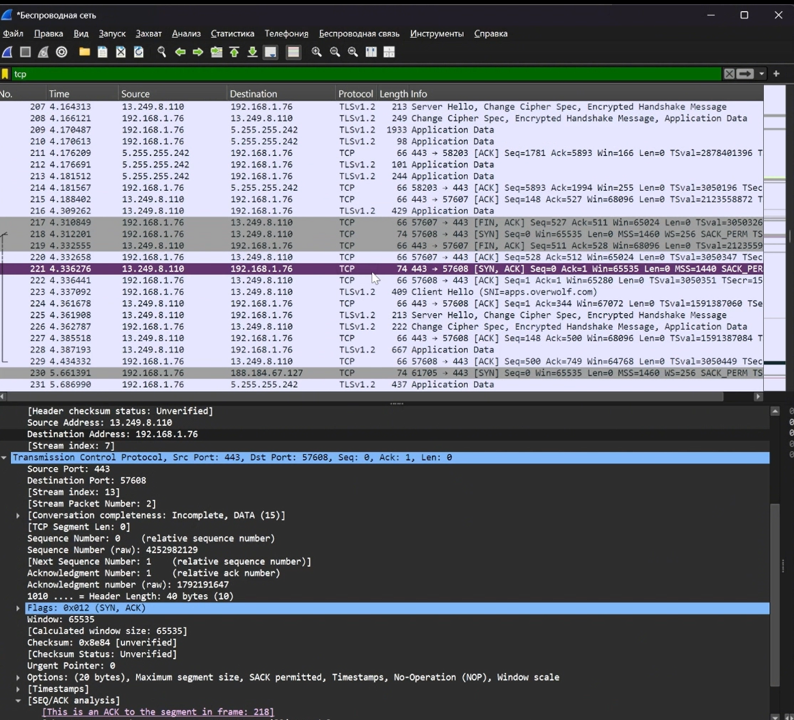{#fig:024 width=70%}

Клиенту остаётся пожать руку — отправить ack. Источник 192.168.1.76, порт 57608, получатель 13.249.8.110, порт 443. Во флагах только ACK, sequence number 1, acknowledgment number 1 (рис. [-@fig:025]).

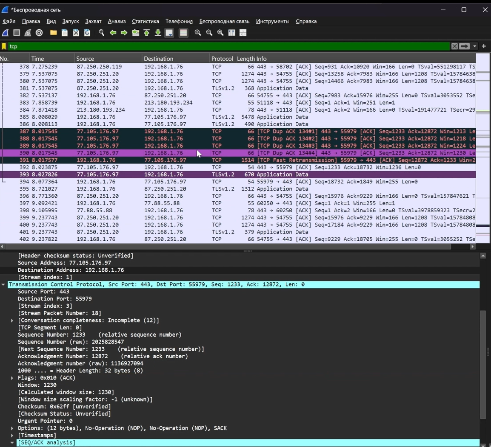{#fig:025 width=70%}

Посмотрим на график потока. На нём хорошо видно хендшейк (SYN, SYN+ACK, ACK) прямо перед запросом GET (рис. [-@fig:026]).

{#fig:026 width=70%}

# Выводы

В результате выполнения работы были получены навыки анализа пакетов в wireshark.

# Список литературы {.unnumbered}

1. Wireshark Foundation. Wireshark User's Guide [Электронный ресурс]. — URL: https://www.wireshark.org/docs/wsug_html_chunked/ (дата обращения: 07.10.2026).

2. Wireshark Foundation. Wireshark Display Filter Reference [Электронный ресурс]. — URL: https://www.wireshark.org/docs/dfref/ (дата обращения: 07.10.2026).

3. IETF. RFC 826: An Ethernet Address Resolution Protocol [Электронный ресурс]. — URL: https://datatracker.ietf.org/doc/html/rfc826 (дата обращения: 07.10.2026).
